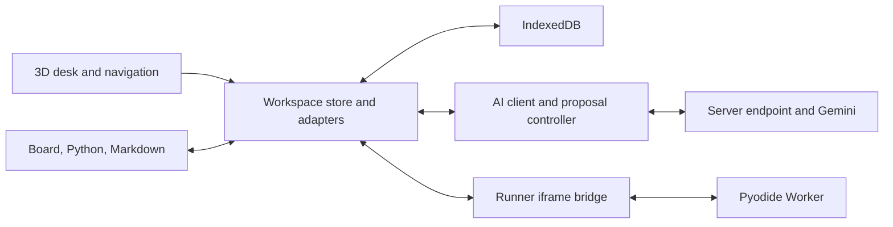

# Technical architecture

## Status and design goal

The local MVP is implemented. This document describes the delivered boundaries as of September 12, 2026, and identifies the remaining design targets. The application is one Next.js project; the Python runner is a set of static files the app serves from `/runner/` on its own origin, so a single Vercel deployment carries both.

Deliver one persistent study workspace whose tools remain usable independently of the 3D scene and AI service. Prefer explicit state and operation boundaries over additional orchestration frameworks.

## Stack

| Concern               | Choice                                                               | Reason                                                          |
| --------------------- | -------------------------------------------------------------------- | --------------------------------------------------------------- |
| Application           | Next.js App Router, React, TypeScript                                | One application and a server endpoint for model requests        |
| Desk                  | Three.js through React Three Fiber, minimal Drei helpers             | Declarative scene integration and on-demand rendering           |
| Whiteboard            | Excalidraw                                                           | Existing drawing, diagramming, selection, and scene APIs        |
| Code and note editing | CodeMirror 6                                                         | Text transactions, selections, history, and language extensions |
| Markdown preview      | react-markdown and remark-gfm                                        | Markdown rendering with raw HTML disabled                       |
| Workspace state       | Zustand plus explicit editor adapters                                | Shared artifact ownership above navigation                      |
| Persistence           | IndexedDB with a versioned storage adapter                           | Local documents, run snapshots, and exportable workspace state  |
| Product AI            | Gemini through the server-side @google/genai SDK                     | Shared multimodal context and function calls                    |
| Python                | Pyodide in a dedicated Worker behind an app-served iframe bridge     | Browser execution without blocking editor interaction           |

The installed versions are pinned in [package.json](../package.json) and [package-lock.json](../package-lock.json). These files are the version authority; the stack table records why the components were chosen.

## Application boundaries

### Workspace and editors

The workspace owns document content, artifact revisions, accepted change records, references, conversation, and execution records. UI state such as active tool is distinct from persisted document content.

CodeMirror and Excalidraw own their editor instances and session history. Manual changes update Zustand immediately. Accepted text changes update the controlled CodeMirror document; board changes use Excalidraw's scene API with immediate history capture. Adapters provide focus/reveal operations and a board image export. There is no separate editor transaction service or explicit pre-request flush API: correctness depends on the editors' immediate change callbacks.

Initialized editors remain mounted but hidden and inert when inactive, and their layout is refreshed when shown. The store remains authoritative if an editor is recreated. Navigation clears the shared AI selection; the editor's own cursor and scroll can remain in its mounted instance.

Navigation requests a save. AI requests and Python runs capture the current store synchronously; AI context is then cloned. Only persistence and board-preview generation are delayed. Preserving the final stroke or keystroke remains a regression requirement.

### Scene

The scene consumes navigation state and derived artifact previews. It never owns code, notes, board elements, or conversation.

Use client-only loading boundaries for browser-dependent packages. Next.js documents that `ssr: false` belongs in Client Components. Keep the workspace store above these boundaries so lazy loading cannot reset it.

The scene renders on demand, and camera transitions and changed preview textures request frames. It is unmounted when an editor occupies the workspace. Small screens, context loss, and graphics failures use 2D navigation cards; the student can also choose the simple view. None of these paths owns or resets artifact data.

### AI boundary

The browser owns authoritative artifact state. Manual editing and local saving do not call Gemini. Sending a study-partner request transmits bounded board, code, notes, run, source-reference, and conversation context to the application's `/api/ai` endpoint and then to Gemini. A board screenshot may also be included. Local persistence therefore does not mean an AI request stays on the device.

The server owns `GEMINI_API_KEY` and the configurable `GEMINI_MODEL`; the default is `gemini-3.8-flash`. The key is neither a public environment variable nor part of workspace exports. The server does not keep an independent mutable workspace or execute the model's tools.

The client validates requested operations, executes permitted reads, previews writes, and returns actual results to the model. Accepting a change must pass the revision checks in [AI collaboration](ai-collaboration.md).

The client permits one active AI job and at most eight model/tool rounds. Each server request performs one streamed generation and returns NDJSON text, validated function calls, and continuation data. Complete candidate parts and opaque thought signatures survive the next tool round. The client closes the HTTP stream before awaiting Apply or Reject; review does not require a server process or connection to remain alive.

The endpoint requires a matching `Origin` and rejects cross-site fetch metadata. It validates JSON, content types, continuation roles and tool-result pairing. Limits include a 6 MiB request body, 192 KiB textual context, 2 MiB of base64 image data, 4 MiB continuation, and 192 KiB tool results. Provider output is capped at 4,096 tokens, 512 KiB of parts, and 12 calls per response. Body reading has a 10-second deadline; provider requests have a 50-second timeout within a 55-second route deadline.

A process-local limiter allows 36 requests per minute across this local instance. An actual provider HTTP 503 before the first chunk gets one cancellable retry after 750 ms within the same deadline. There is no automatic retry for HTTP 429, missing configuration, or a response that already streamed a chunk. Errors expose safe messages rather than provider exception details. This is not authentication, a distributed quota, or a spending cap. Public deployment requires a deliberate hosting, runner-origin, access, and budget design.

## Persistence and lifecycle

The version-1 workspace is saved through a serialized IndexedDB write queue after a 450 ms debounce. Saves validate a cloned snapshot before writing, so an older write cannot finish after a newer queued write or knowingly save data that reload would reject. Editors wait for hydration.

| State                                                  | Change tool / return to desk                                               | Browser reload                                       |
| ------------------------------------------------------ | -------------------------------------------------------------------------- | ---------------------------------------------------- |
| Board, code, and notes                                 | Retained                                                                   | Restored from local storage                          |
| Cursor and text scroll                                 | Retained in mounted editors; shared context selection clears on navigation | Start fresh                                          |
| Board viewport                                         | Retained                                                                   | Restored from saved viewport                         |
| Editor undo history                                    | Retained during the session                                                | May start fresh                                      |
| Conversation and accepted changes                      | Retained                                                                   | Restored                                             |
| Completed run output and source snapshot               | Retained                                                                   | Restored                                             |
| Active Python run                                      | Continues unless stopped                                                   | Mark interrupted; do not imply it resumed            |
| Pending AI request                                     | Continues unless cancelled                                                 | Mark interrupted; never replay a write automatically |
| Python globals, imports, module mutations, and streams | Fresh Worker after every run                                               | Not restored                                         |

The UI shows Saving, Saved locally, and save errors. Failed writes retain in-memory work and offer export/retry. An unreadable or invalid stored workspace enters recovery mode: the existing saved value is preserved, automatic writes are disabled, and the user can download the saved recovery copy or import a valid replacement. A failed write is not reported as saved.

Store only serializable document and view data, not DOM objects, editor APIs, Worker handles, abort controllers, or provider credentials. Keep any board binary files in a dedicated asset store if they are supported later.

Workspace JSON export/import and `.py`/`.md` downloads are implemented. Import checks the 15 MB file limit, schema, supported drawing types and geometry, unique drawing IDs, and change-snapshot types before asking to replace the current workspace. Replacement stops the current AI job and Python run. Import and hydration mark unfinished messages/runs interrupted rather than replaying them. Board image uploads and a binary asset store are not supported. Local saving covers this browser/device and is not cloud synchronization.

## Python execution

The agreed surface is one Python file with output and errors. There is no shell, REPL, arbitrary package installation, debugger, interactive `input()`, or multi-file filesystem interface.

The runner iframe begins loading the pinned Pyodide runtime when the workspace mounts. `scripts/build-runner.mjs` copies the runner modules and the five Pyodide runtime files from the installed package into `public/runner/` before `next dev` and `next build`, and the app serves them at `/runner/`. NumPy, Matplotlib, and arbitrary package downloads are not copied, so they are unavailable.

### Isolation

A Worker prevents computation from blocking the main thread but is not a separate security origin. The runner iframe is served from the application's own origin at `/runner/index.html`; the bridge accepts messages only from its parent window on that same origin, and the client accepts messages only from the exact iframe window. The runner creates its own Worker. An earlier design served the runner from a second process on a separate origin, which gave a real origin boundary but could not be deployed as a single hosted project; it was replaced by this app-served layout.

`/runner/*` responses carry a CSP that restricts scripts, workers, and network connections to the app origin, plus `X-Frame-Options: SAMEORIGIN`; every other path keeps `DENY`. The header list lives in `scripts/build-runner.mjs` so the browser test serves exactly what the app serves. The bridge validates origin, exact source window, protocol version, run ID, message type, sequence, and payload limits. Python receives empty JavaScript globals, and no application storage, model key, or workspace operation API is handed to the runner. Output cannot issue workspace edits or AI calls.

Because the runner shares the app origin, a deliberately hostile program that escapes Pyodide's JavaScript bridge could reach the app's browser storage or API routes. This is a constrained browser runner for a learner's own study examples, not a multi-tenant execution service, and that trade-off is accepted. Browser memory use has no hard per-program quota. CSP and same-origin bridge behavior have dedicated real-browser tests.

### Run contract

| Message      | Required information                                                            |
| ------------ | ------------------------------------------------------------------------------- |
| Run request  | `protocol: ideate-python`, `version: 1`, `type: run`, unique `id`, exact `code` |
| Output event | Run ID, sequence number, stdout/stderr channel, bounded plain-text chunk        |
| Completion   | Run ID, status, elapsed time, optional error string and `main.py` line          |
| Stop request | Run ID to terminate                                                             |

Only one program runs at a time. The bridge schema accepts optional artifact/revision/hash metadata, but the current caller sends the run ID and exact source text; the browser's saved `Run` records the code revision. No source hash is computed or stored. Execution uses the fixed filename `main.py` for traceback lines.

Every run gets fresh Python globals, and its Worker is terminated and recreated after success, error, Stop, timeout, or output overflow. Imported-module changes, replaced builtins, closed streams, and other Python state cannot survive into the next run. Reinitialization has a cost; the earlier design option of keeping a warm Python session was not adopted.

Keep both the source revision and source text in the execution record. Editing the file during a run changes the current document but cannot change the captured program. Show output as stale when its source no longer matches the current code. Error links must not point confidently at a different revision.

Execution has a ten-second limit after runtime initialization and a 64 KiB combined UTF-8 output limit. The bridge also bounds source to 256 KiB and output messages to 8 KiB, with a 45-second initialization deadline and a parent-side timeout backup. Overflow stops execution and retains the captured prefix. These are constants in `runner/protocol.mjs`, not exposed user settings.

Stop and timeout terminate the Worker and create a new one. Ignore messages from a terminated run. Preserve source and captured output. Distinguish success, Python error, timeout, cancellation, runtime failure, and browser interruption.

Pyodide captures stdout/stderr and the actual exception and source line from the failing execution. The wire protocol distinguishes stdout and stderr; the saved `Run` combines them into one ordered `output` string and stores the error separately. No-output completion is success. Output is rendered as plain text. Clear hides the latest result in the panel; it does not delete its saved source evidence. Runtime failure and Python exceptions share the `error` status and differ through their messages.

Graceful interrupts using shared memory are unnecessary for the first version. Worker termination avoids making shared-memory response headers an early dependency.

## Main entities

All identifiers are stable within the workspace. Artifact revisions increase monotonically for manual edits, accepted AI edits, and undo operations. Selection and camera movement do not change a document revision.

| Entity               | Fields and responsibility                                                                                                                                                      |
| -------------------- | ------------------------------------------------------------------------------------------------------------------------------------------------------------------------------ |
| Workspace            | `id`, `schemaVersion: 1`, title, board/code/notes, runs, messages, changes, references, accepted operation IDs, `updatedAt`; active tool/preferences are transient store state |
| BoardDocument        | `id`, `revision`, Excalidraw elements with stable IDs, saved viewport                                                                                                          |
| CodeDocument         | `id: code`, `revision`, `text`; `main.py` is a UI/runtime constant, not a stored filename field                                                                                |
| NoteDocument         | `id: notes`, `revision`, `text`; download filename is a UI constant                                                                                                            |
| ArtifactRef          | Unique reference `id`, `tool`, revision, label, saved excerpt, optional board IDs, UTF-16 range, or `runId`                                                                    |
| ExecutionRun (`Run`) | `id`, exact `code`, revision, combined output, status, start time, duration, optional error/line; no hash                                                                      |
| ConversationMessage  | `id`, role, text, optional sources/status; job ID and provider continuation remain transient in the client controller                                                          |
| ChangeSet (`Change`) | Operation `id`, target, summary, full before/after snapshots, result revision, sources, optional undone flag; no persisted job/message ID or separate forward/inverse patch    |
| Proposal             | Transient operation `id`, `jobId`, target, base revision, typed patch, summary, sources, source revision guards                                                                |

An `ArtifactRef` locator identifies board element IDs, a revision-bound text range, or a run/output range. Text offsets never silently carry across unrelated revisions. Board references use stable IDs; deleted elements resolve to their saved excerpt or an unavailable-source indicator.

An AI proposal records source references; Apply commits them with an undoable change. Notes can contain reviewed Markdown links to those references, with saved excerpts and revisions. `link_artifacts` currently creates this notes patch; metadata links into board/code are explicitly unsupported. Each editing step targets one artifact rather than an implicit global transaction.

Initial AI context includes all three artifacts, so initial source guards conservatively check all three revisions, even when the requested edit targets one. Reads can refresh known revisions. This can reject a proposal after an edit that turns out to be unrelated; narrower dependency tracking is a future refinement, not current behavior.

Saved runs retain full source text, and references retain selected excerpts. The working history keeps 200 messages, 40 undo changes, 100 runs, and 1,000 operation IDs. Reference retention prioritizes links in the current notebook; those saved excerpts remain available when an old run leaves the bounded run list. Previews are derived from artifact revisions and can be regenerated.

## Validation evidence and remaining targets

The repository has automated coverage for the boundaries below, including real Pyodide execution, app-served runner browser checks, board adapters, persistence/recovery, and AI controller state. The Gemini preflight has demonstrated text streaming, image recognition, and a function call continued with its thought signature intact. A live browser explanation also succeeded. Later live notes/model requests encountered intermittent provider 503/502 failures; successful access does not establish dependable capacity or full teaching quality. See [AI collaboration](ai-collaboration.md) for the bounded retry and model-evaluation limits.

The following remain acceptance criteria to preserve as the implementation changes, not a claim that every UX scenario has been exhaustively evaluated:

| Boundary                                | Experiment and pass condition                                                                              |
| --------------------------------------- | ---------------------------------------------------------------------------------------------------------- |
| Excalidraw and workspace                | Create selected connected shapes, apply an annotation, undo, hide/show, and preserve bindings and content  |
| Immediate capture and persistence       | Type/draw and immediately switch; reload after save; retain the final edit                                 |
| Editor transactions and revision checks | Return a proposal based on revision N after a manual edit to N+1; reject it without modifying the document |
| Worker and browser                      | Print, raise an error, loop forever, stop, and run again while navigation remains responsive               |
| Runner origin                           | Demonstrate that executed code cannot access application storage, credentials, or workspace operations     |
| Model and client state                  | Apply a proposal only once; cancellation and delayed provider responses cannot produce a late edit         |
| Scene and editors                       | Repeatedly switch views on the demonstration laptop with correct focus and pointer coordinates             |

See [decisions and sources](decisions-and-sources.md) for the documentation supporting these choices.
